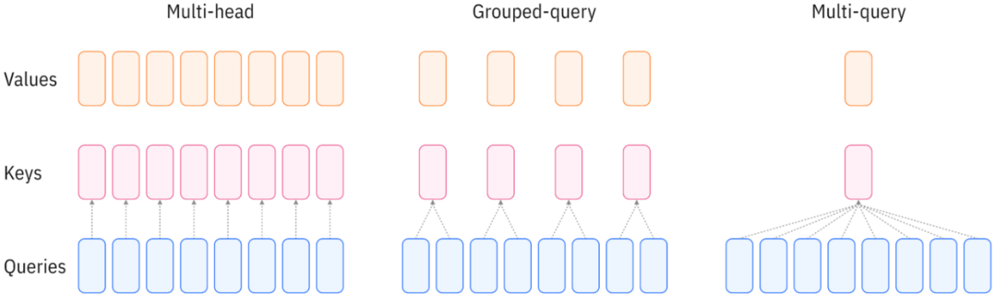

## 1. Introduction

The attention mechanism is at the heart of Transformer models. Several variants have been proposed to balance model quality and inference efficiency:

* **Scaled Dot-Product Attention.** The fundamental building block computes attention scores between queries and keys, scales them to prevent vanishing gradients, and uses the resulting weights to aggregate values:
  $$
  \operatorname{Attention}(Q, K, V) = \operatorname{softmax}\left(\frac{QK^T}{\sqrt{d}}\right)V
  $$
  It produces a single $(n, n)$ attention map, which is insufficient to capture fine-grained information across sequences from different perspectives.

* **Multi-Head Attention (MHA).** Instead of computing a single attention function, MHA runs multiple attention operations in parallel, each with different learned projections:
  $$
  \operatorname{MHA}(Q, K, V) = \operatorname{Concat}(\mathrm{head}_1, \cdots, \mathrm{head}_h)W^O
  $$
  Each head learns its own attention pattern. For example, one head might focus on syntactic relationships, while another might capture semantic similarity. This allows different dimension groups to "look at different places," significantly increasing model expressiveness. However, during autoregressive inference, MHA requires caching K and V for all heads, resulting in large memory requirements that can become a bottleneck for long sequences.

* **Multi-Query Attention (MQA).** MQA addresses the KV cache problem by having multiple query heads share **a single key-value head**. Each head still computes its own attention pattern via different Q projections, but they all reference the same K and V. This reduces the KV cache size by a factor of $h$ (the number of heads), dramatically improving inference speed. The trade-off is a reduction in model quality since the diversity in attention patterns comes only from the queries.

## 2. GQA: Grouped-Query Attention

GQA provides a middle ground between MHA and MQA by grouping query heads to share key-value heads. Instead of all query heads sharing one KV head (MQA) or each having its own (MHA), GQA divides $h$ query heads into $g$ groups, where each group shares one KV head.

Consider a model with $d = 512$ and $h = 8$ heads. The dimension changes for each variant are:

| Step           | Multi-Head   | Multi-Query                 | Grouped-Query ($g=4$)       |
| -------------- | ------------ | --------------------------- | --------------------------- |
| Input $X$      | $(n, 512)$   | $(n, 512)$                  | $(n, 512)$                  |
| Q projection   | $(n, 512)$   | $(n, 512)$                  | $(n, 512)$                  |
| K projection   | $(n, 512)$   | $(n, 64)$                   | $(n, 256)$                  |
| V projection   | $(n, 512)$   | $(n, 64)$                   | $(n, 256)$                  |
| Reshape Q      | $(8, n, 64)$ | $(8, n, 64)$                | $(8, n, 64)$                |
| Reshape K      | $(8, n, 64)$ | $(1, n, 64) \to (8, n, 64)$ | $(4, n, 64) \to (8, n, 64)$ |
| Reshape V      | $(8, n, 64)$ | $(1, n, 64) \to (8, n, 64)$ | $(4, n, 64) \to (8, n, 64)$ |
| Attention maps | $(8, n, n)$  | $(8, n, n)$                 | $(8, n, n)$                 |
| Output         | $(n, 512)$   | $(n, 512)$                  | $(n, 512)$                  |

The key insight is that GQA interpolates between MHA and MQA:

| Variant               | Q heads | KV heads | KV cache reduction |
| --------------------- | ------- | -------- | ------------------ |
| Multi-Head Attention  | 8       | 8        | 1× (baseline)      |
| Grouped-Query ($g=4$) | 8       | 4        | 2×                 |
| Grouped-Query ($g=2$) | 8       | 2        | 4×                 |
| Multi-Query Attention | 8       | 1        | 8×                 |



## 3. Implementation

Code is adapted from [1] and [2].

```python
n_head = 6
n_kv_head = 3 # 1: MQA; 3: GQA; 6: MHA
n_embd = 768
head_dim = n_embd // n_head # 128

class CausalSelfAttention(nn.Module):
    def __init__(self, layer_idx):
        self.layer_idx = layer_idx
        self.Wq = nn.Linear(n_embd, n_head*head_dim, bias=False)
        self.Wk = nn.Linear(n_embd, n_kv_head*head_dim, bias=False)
        self.Wv = nn.Linear(n_embd, n_kv_head*head_dim, bias=False)
        self.Wo = nn.Linear(n_embd, n_embd, bias=False)
        
    def forward(self, x, cos_sin, kv_cache):
        B, T, C = x.size()
        
        # Project the input to get queries, keys, and values
        q = self.Wq(x).view(B, T, n_head, head_dim)
        # Since GQA uses n_kv_head < n_head, it can save memory in the kv cache.
        k = self.Wk(x).view(B, T, n_kv_head, head_dim)
        v = self.Wv(x).view(B, T, n_kv_head, head_dim)
        
        # Apply Rotary Embeddings, QK-Norm
        # q = ...
        # k = ...
        q, k, v = q.transpose(1, 2), k.transpose(1, 2), v.transpose(1, 2) # make head be batch dim, i.e. (B, T, H, D) -> (B, H, T, D)
        
        # Apply KV cache: insert current k,v into cache, get the full view so far
        # ...
        
        enable_gqa = n_head != n_kv_head # Group Query Attention (GQA)
        out = F.scaled_dot_product_attention(q, k, v, is_causal=True, enable_gqa=enable_gqa)
        # In F.scaled_dot_product_attention, see https://docs.pytorch.org/docs/stable/generated/torch.nn.functional.scaled_dot_product_attention.html
        # n_rep = n_head // n_kv_head  # e.g., 6 // 3 = 2
        # k = k.repeat_interleave(n_rep, dim=1)  # (B, 3, T, 128) → (B, 6, T, 128)
        # v = v.repeat_interleave(n_rep, dim=1)  # (B, 3, T, 128) → (B, 6, T, 128)
        
        # Re-assemble the heads side by side and project back to residual stream
        out = out.transpose(1, 2).contiguous().view(B, T, -1)
        out = self.Wo(out)
        return out
```

---

## References

[1] https://github.com/karpathy/nanochat/blob/master/nanochat/gpt.py

[2] https://docs.pytorch.org/docs/stable/generated/torch.nn.functional.scaled_dot_product_attention.html